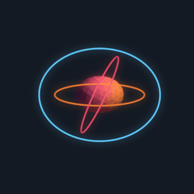

<!-- ==================== HEADER ==================== -->
<div align="center">
  
</div>

<!-- ==================== TYPING BOOT ==================== -->
<div align="center">
  
</div>

<div align="center">
  
  
  
</div>

<br/>

<!-- ==================== SYSTEM PROFILE ==================== -->
## 🤖 System Profile

<table>
<tr>
<td width="60%" valign="top">

```bash
$ sudo initialize satyam --profile

[ OK ]  Mounting developer modules...
> name      : Satyam Aggarwal
> role      : Java & Full-Stack Developer
> education : MCA @ GL Bajaj Institute
> stack     : Java · MERN · Python/AI · SAP ABAP
> learning  : DSA · Advanced Java · Full Stack
> fun_fact  : code + fitness, equally ⚡
> contact   : satyam.aggarwal1t2@gmail.com

[ OK ]  Developer online. Ready to build 🤖
```


</td>
<td width="40%" align="center" valign="middle">



</td>
</tr>
</table>

<br/>

<!-- ==================== TECH ARSENAL ==================== -->
## ⚙️ Tech Arsenal

**`> Languages`**

<div>
  
  
  
  
  
  
  
</div>

**`> Frontend`**

<div>
  
  
  
  
  
</div>

**`> Backend & Database`**

<div>
  
  
  
  
  
  
  
</div>

**`> Tools`**

<div>
  
  
  
  
</div>

<br/>

<!-- ==================== DEPLOYED SYSTEMS ==================== -->
## 🛰️ Deployed Systems

| Project | Description | Stack |
|---------|-------------|-------|
| **[📈 InvestAI Analyst](https://github.com/Satyam123324/investai-analyst)** | AI stock analyst that stages a **Bull vs Bear** debate on any ticker using live financial data. | `Next.js` · `FastAPI` · `Python` |
| **[📸 PhotoConnect](https://github.com/Satyam123324/Photography-website)** | MERN photographer booking platform with an *Editorial Noir* redesign and 3D scroll animations. | `MongoDB` · `Express` · `React` · `Node` |
| **🎁 GiftSoul** | Emotion-driven gift recommendation platform with a scroll-driven 3D gift-box hero. | `React` · `Vite` · `Three.js` |
| **🧠 Knowledge Gap Platform** | Skill-gap intelligence system from the **Infosys Springboard 7.0** internship — maps skills, detects gaps, recommends training. | `Spring Boot` · `React` · `PostgreSQL` |

<br/>

<!-- ==================== METRICS ==================== -->
## 📊 Performance Metrics

<div align="center">
  
  
</div>

<div align="center">
  
  
</div>

<div align="center">
  
</div>

<div align="center">
  
</div>

<!-- ==================== SNAKE ==================== -->
## 🐍 Contribution Snake

<div align="center">
  <picture>
    <source media="(prefers-color-scheme: dark)" srcset="https://raw.githubusercontent.com/Satyam123324/Satyam123324/output/github-contribution-grid-snake-dark.svg"/>
    <source media="(prefers-color-scheme: light)" srcset="https://raw.githubusercontent.com/Satyam123324/Satyam123324/output/github-contribution-grid-snake.svg"/>
    
  </picture>
</div>

<br/>

<!-- ==================== UPLINK ==================== -->
## 📡 Establish Uplink

<div align="center">
  <a href="https://www.linkedin.com/in/Vanity"></a>
  <a href="https://instagram.com/aggarwal_satyam_41"></a>
  <a href="mailto:satyam.aggarwal1t2@gmail.com"></a>
  <a href="https://github.com/Satyam123324"></a>
</div>

<!-- ==================== FOOTER ==================== -->
<br/>

<div align="center">
  
  <br/><br/>
  
</div>
